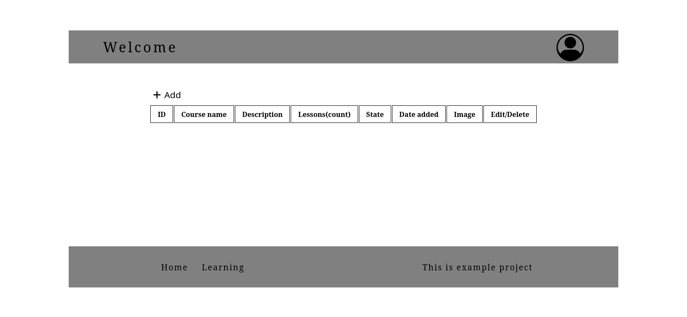
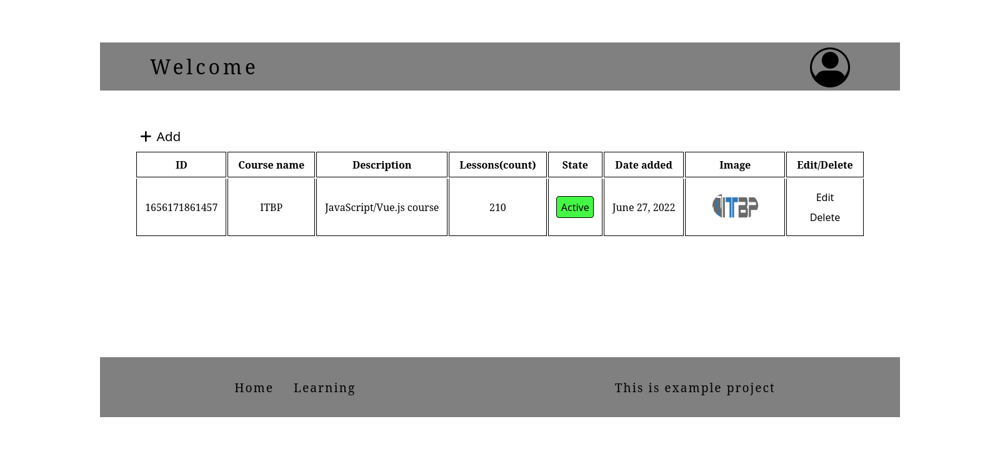
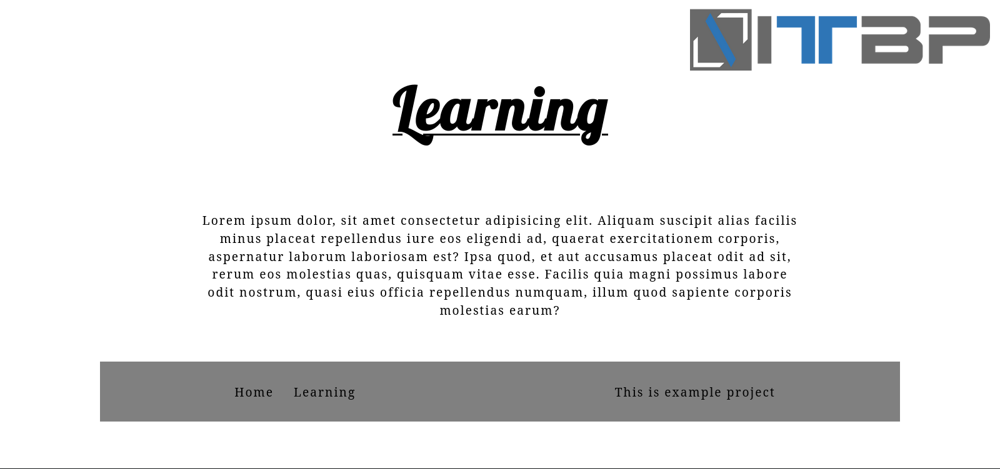

## About The Project

My motivation to create this application is driven by my desire to develop as a programmer. After this project I realized that there are no impossible things.
What is this project and what is it doing?

- Creating a table with a unique identifier
- If desired, a photo can be uploaded
- Flexible table, easy to use, fast orientation, simple and resposive design
- Single page application
- The first page is an information page
- The second page is the table
- Fast functioning
- Ability to delete or update data a row in the table

Not the perfect table but, of course, over time, the table will improve both the design and the way the table works. The next step is to work on the backend part.

### Built With

-Major framework

- [Vue.js](https://vuejs.org/)

-Font Awesome link

- [Fontawesome](https://fontawesome.com/)

--Font Awesome CDN

- https://cdnjs.cloudflare.com/ajax/libs/font-awesome/6.1.1/css/all.min.css

## Getting Started

What will you need to start a project with VueJs for Single Page App

### Prerequisites

-Install Node.js

```sh
 install nodejs
```

-Install Vue.js

```sh
 npm init vue@latest
```

\*\*Scaffolding tool/Optional features

- Project name: … (Your project name)
- Add TypeScript? … No
- Add JSX Support? … No
- Add Vue Router for Single Page Application development? … Yes
- Add Pinia for state management? … No
- Add Vitest for Unit testing? … No
- Add Cypress for both Unit and End-to-End testing? … No
- Add ESLint for code quality? … No
- Add Prettier for code formatting? … No

-Install npm packages

```sh
npm install
```

## Or you can download Node.js

-Download Node.js

- [nodejs](https://nodejs.org/en/)

### Install App

1. Clone the repo
   ```sh
   git clone https://github.com/IliyanYankov/Learning-ITBP
   ```
2. Install NPM packages
   ```sh
   npm install
   ```
3. Run Project
   ```sh
   npm run dev
   ```
4. To build

   ```sh
   npm run build
   ```

## Usage

-Home page with text.

-You can create, change, delete and read information from the table.







## Contributing

-If you want, you can help me to improve this project!

1. Fork the Project
2. Create your Feature Branch (`git checkout -b `)
3. Commit your Changes (`git commit -m`)
4. Push to the Branch (`git push origin `)
5. Open a Pull Request

## Contact

Iliyan Yankov - [@facebook](https://www.facebook.com/iliqn.qnkov.14)

Email: ilianankov5@gmail.com

Project Link: [https://github.com/IliyanYankov/Learning-ITBP](https://github.com/IliyanYankov/Learning-ITBP)

## Acknowledgments

Resources that I find useful

- [Vue.js documentation](https://vuejs.org/guide/introduction.html)
- [How to write Readme file](https://www.freecodecamp.org/news/how-to-write-a-good-readme-file/)
- [Best place to learning](https://www.w3schools.com/)
- [JavaScript documentation](https://developer.mozilla.org/en-US/docs/Web/JavaScript)
- [Github tutorial](https://product.hubspot.com/blog/git-and-github-tutorial-for-beginners)
